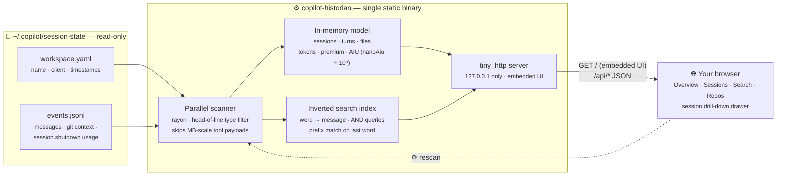

# Copilot Historian


A self-contained dashboard for exploring your **GitHub Copilot CLI session history** —
full-text search, token & AIU consumption, premium requests, models, repos, summaries,
and complete conversation drill-down.

Single static binary. No runtime dependencies, no database, no network calls.
It reads your local `~/.copilot/session-state` directory (read-only) and serves an
embedded web UI on localhost.

## Quick start

```
cargo build --release
./target/release/copilot-historian      # scans ~/.copilot/session-state, opens browser
```

```
USAGE: copilot-historian [--dir <session-state dir>] [--port <port>] [--no-open]

  --dir, -d    session directory (default: ~/.copilot/session-state)
  --port, -p   listen port (default: 4577)
  --no-open    don't launch the browser
```

The binary is fully portable: copy it to any machine (same OS/arch) and point it at a
session-state directory with `--dir`. Cross-compile with the usual
`cargo build --release --target <triple>` for other platforms.

## What you get

| View | Contents |
|---|---|
| **Overview** | Totals (sessions, prompts, tool calls, input/output/cache tokens, premium requests, AIU, lines of code changed, model API time), daily activity chart, per-model usage table, top repos, tool usage |
| **Sessions** | Filterable/sortable table (full-text, repo, model, date range) with per-session tokens, AIU, premium, code delta |
| **Search** | Indexed full-text search across your prompts, assistant replies, task summaries, and metadata (file paths, repos, model names). Last word matches by prefix; results show highlighted snippets and jump into the conversation |
| **Repos** | Per repo/directory aggregation: sessions, AIU, premium, tokens, prompts, code delta, branches, top sessions |
| **Session drawer** | Full metadata (repo, branch, cwd, client, CLI version, wall span, API time), usage cards, per-model table, run segments, files modified, tools used, task summaries, and the whole conversation |

## How it works



- Scans every `<session-id>/` directory under the session-state root in parallel (rayon).
- Parses `workspace.yaml` (name, client, timestamps) and `events.jsonl`.
- Only relevant event types are fully parsed (`session.start/resume`, `user.message`,
  `assistant.message`, `session.shutdown`, `session.task_complete`, …). Multi-megabyte
  tool outputs are skipped via a cheap head-of-line check, so ~200 MB of history scans
  in a few seconds.
- Usage data comes from `session.shutdown` events, which the CLI emits **per run
  segment** (each launch/resume). Historian sums segments per session:
  - `tokenDetails` → input / output / cache-read tokens
  - `totalPremiumRequests` → premium requests
  - `totalNanoAiu` / 1e9 → **AIU** (AI units)
  - `modelMetrics` → per-model requests, tokens, reasoning tokens, AIU
  - `codeChanges` → lines added/removed, files modified
- Sessions that never shut down cleanly (or are still running) show "—" for usage.
- An in-memory inverted index powers search; use **Rescan** in the top bar to pick up
  new sessions without restarting.

## API

Everything the UI uses is plain JSON, handy for scripting:

```
GET /api/overview
GET /api/sessions?q=&repo=&model=&from=YYYY-MM-DD&to=&sort=updated|created|tokens|aiu|premium|turns|duration&dir=asc|desc&limit=&offset=
GET /api/session/<id-or-prefix>
GET /api/search?q=&role=0|1|2|3&limit=&offset=
GET /api/repos
GET /api/rescan
```

## Privacy

Read-only, localhost-only (`127.0.0.1`), zero telemetry, nothing leaves your machine.
